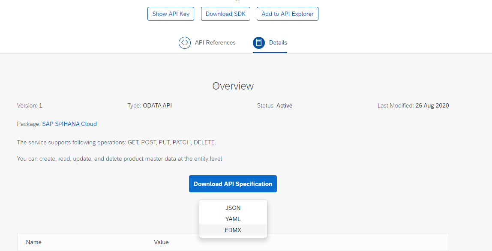

# Live-Coding Session

The aim of this Session, is to show how fast you can develop solutions with RAP and Steampunk, that would normally cost you days!

- [Live-Coding Session](#live-coding-session)
  - [Our Scenario](#our-scenario)
  - [Intention](#intention)
  - [What's RAP](#whats-rap)
  - [Getting the Products](#getting-the-products)
  - [Create Table](#create-table)
  - [Create Business Object](#create-business-object)
    - [Create CDS Root View](#create-cds-root-view)
    - [Create Behavior Definition](#create-behavior-definition)
    - [Create Behavior Implementation](#create-behavior-implementation)
    - [Create the Service Definition](#create-the-service-definition)
    - [Create the Service Binding](#create-the-service-binding)
    - [Define Metadata-Annotations](#define-metadata-annotations)
  - [Consume OData-Service](#consume-odata-service)
    - [Get the Metadata](#get-the-metadata)
    - [Create OData Consumption Model](#create-odata-consumption-model)
  - [Create a Custom Entity](#create-a-custom-entity)
  - [Extend the CDS View](#extend-the-cds-view)
  - [Validate User-Input](#validate-user-input)
    - [Define Validation](#define-validation)
    - [Code to Check](#code-to-check)
  - [Beautify the UI](#beautify-the-ui)
  - [Build your first BO with RAP-Generator (optional)](#build-your-first-bo-with-rap-generator-optional)

## Our Scenario

In a short time, we want to build a simple application, where a customer can rank a product. But to make it more exotic and show the strength of the cloud, our product list is not on the same system, but somewhere on an other system and has to be consumed via OData.

.png)

## Intention

The SAP technology stack has evolved in recent years and many developers and companies have been unable to keep up with the latest capabilities. Especially the latest versions offer a lot of tools and capabilities to be better than ever before - but a system upgrade also requires an upgrade of the employees' skillset to unleash the full power.


By [Andreas Gautsch](https://twitter.com/andreas_gautsch/status/1306320809623986177?s=20)

## What's RAP

The ABAP RESTful Programming Model is the newest way and technology provided by SAP to create modern, RESTful applications with web based UIs - especially focused naturally on SAP UI5.
Google delivers a lot of information on this technology by simply searching for "SAP RAP". Of course useful sources to get in touch with it, are as follows:

- [Official documentation](https://help.sap.com/viewer/923180ddb98240829d935862025004d6/Cloud/en-US/289477a81eec4d4e84c0302fb6835035.html?q=abap%20restful%20programming)
- [Blog Post by Sony Sukumar Kattoor as overview](https://blogs.sap.com/2019/05/23/sap-cloud-platform-abap-restful-programming-model-rap-for-beginners/)
- [Almost every post by André Fischer](https://people.sap.com/andre.fischer)
- [...and also Florian Wahl](https://people.sap.com/florian.wahl)

In very short terms explained:
In former days, SAP logic was encapsulated by Business Objects, build out of Function Modules and Function Groups. But without any consistency in naming and functionality, a lot of experience was needed to find the right FM for the right task - if one such even existed!
Since S/4HANA, we have new **first class citizens** - and these are CDS Views! With Core Data Service Views, SAP invented a wrapper for a lot of Application Server Side logic. In former days hidden in Function Modules, programmed in ABAP and containing the knowledge how the data of a Business Object belong together - not very much "Code-Pushdown" as SAP preaches it since the first days of SAP HANA. All this changed with CDS, but these are Database **VIEWS** and as in every other database like Oracle or MS SQL, Views are read-only.
Based on these CDS Views, SAP redesigns the existing Business Objects to make them also easily consumable via OData and by doing this, also for SAP UI5.


The foundation for a Business Object is now a CDS View (or a [CDS View Entity which is the successor for CDS Views with ABAP Platform 2020](https://blogs.sap.com/2020/09/02/a-new-generation-of-cds-views-cds-view-entities/)).
These Views are connected to a Behavior Definition, which defines the possible actions and a Behavior Implementation, which implements the logic. Out of this, we define a Service Definition, which lists the exposed entities and at least, we enter our protocol we want to use, i.e. OData V2 or OData V4.


## Getting the Products

This example should be a demo on how to bring cloud and on-Prem together, so for this, we need another system to connect to. The easiest way is the demo system provided by SAP via the [SAP API Business Hub](https://api.sap.com/).
Select on that page the SAP S/4HANA Cloud - perhaps an account registration before may be required for you.


On the next page we search for *product* and take a closer look, at the probably best fitting service according to description:


Here we find everything we need to get our product information. We can test the API Calls directly and also create Code Snippets for consuming this service in multiple, different programming languages.


## Create Table

At first step, we have to think about what we need for a simple product rating and create a database table based on these identified requirements.

```abap
@EndUserText.label : 'Product-Rating'
@AbapCatalog.enhancementCategory : #NOT_EXTENSIBLE
@AbapCatalog.tableCategory : #TRANSPARENT
@AbapCatalog.deliveryClass : #A
@AbapCatalog.dataMaintenance : #RESTRICTED
define table zlc_prodrate_999 {
  key client      : abap.clnt not null;
  key rating_uuid : sysuuid_x16 not null;
  forename        : abap.char(40);
  surname         : abap.char(40);
  email           : abap.char(60);
  product         : abap.char(40);
  rating          : abap.int1;
}
```

## Create Business Object

### Create CDS Root View

After creating the table, just right click it and select **New Data Definition** to create a CDS Root View, based on our Database.


The next steps are "as always":


The result should look like this:

```abap
@AccessControl.authorizationCheck: #CHECK
@EndUserText.label: 'CDS-View for Product Rating'
define root view entity ZLC_I_ProdRating_999
  as select from zlc_prodrate_999
{
      //ZLC_PRODRATE_999
  key rating_uuid,
      forename,
      surname,
      email,
      product,
      rating
      //    _association_name // Make association public
}
```

### Create Behavior Definition

Now, we need to make our BO "intelligent". To do this, we create a Behavior Definition - again with some wizard support via right click on the DDLS and selecting **New Behavior Definition**. For sure we'll use **Implementation Type: Managed** because we don't want to loose time with implementing all the coding by ourself.


We define a very simple one and with our next step, we'll implement the Behavior Implementation, which is currently commented out.

```abap
managed; // implementation in class zbp_lc_i_prodrating_999 unique;

define behavior for ZLC_I_ProdRating_999 alias prod_rating
persistent table zlc_prodrate_999
lock master

{
  create;
  update;
  delete;

  field ( numbering : managed ) rating_uuid;
}
```

`field ( numbering : managed ) rating_uuid;` is needed, so that the GUIDs are created automatically and the developer doesn't need to care about :-) .

### Create Behavior Implementation

And again, we use the wizard to create out Behavior Implementation and use the before suggested name.


Simple activating the Behavior Implementation is at the moment everything that needs to be done.

After the creation of the implementation, we need to comment in the class name in the Behavior Definition.

```abap
managed implementation in class zbp_lc_i_prodrating_999 unique;
```

### Create the Service Definition

First time after a while, we don't have an ultra easy wizard :-( - but it's ok.
Simple create a Service Definition by finding the right button in the context-menu.


The work is very easy: with the command `expose`, we describe what entities should be exposed to our service - well, Rocket-Science!

```abap
@EndUserText.label: 'Service Definition for Product Rating'
define service ZLC_I_ProductRating_999 {
  expose ZLC_I_ProdRating_999;
}
```

### Create the Service Binding

The complete logic is contained in the CDS View Entity and the corresponding Behavior Definition and Implementation.
The Service Definition exposes all relevant and needed entities.
The last open point to define, is how the data can be consumed - in detail: Which protocol?
This is done via the Service Binding, and therefore, one has to be created.


A Service Binding brings a Service Definition and a protocol together and creates an Endpoint out of these information, for a later consumption by third party tools.


Clicking the **Preview...**-Button opens a browser windows and shows a first preview of our App - not that sexy and not fully functional so far, because of the missing annotations.


### Define Metadata-Annotations

In this scenario, we use the capabilities of Fiori-Elements, but this is based on annotations and for this, we need to add them to our CDS Entity.

In general, we have three possibilities:

- Define them via UI-Tools like WebIDE in a separate Annotations.xml
- Write them inline, directly into the used CDS View
- Create a separate Metadata-Extension-Object (MDE) on ABAP-Level

We will use the MDE - a little bit more work, but better to maintain in a bigger project.

Right-Click on the CDS DDLS and select "New Metadata Extension" from context-menu.


We select the same name as for our CDS View - just make it simple.


Before we can start with the MDE, we first need to allow this on CDS level by adding the Annotation `@Metadata.allowExtensions: true`.

Defining annotations is again a special snowflake, where a developer can invest a lot of time - in this example it is strapped down to a minimum!

```abap
@Metadata.layer: #CUSTOMER

@UI: {
  headerInfo: { typeName: 'Product Rating', typeNamePlural: 'Product Rating'  } }

@Search.searchable: true
annotate view ZLC_I_ProdRating_999 with
{

  @UI.facet: [ {
      id: 'idCollection',
      type: #COLLECTION,
      label: 'Product Rating',
      position: 10
    },
    {
      id: 'idIdentification',
      parentId: 'idCollection',
      type: #IDENTIFICATION_REFERENCE,
      label: 'General Information',
      position: 10
    } ]

    //ZLC_I_ProdRating_999
  @UI.hidden: false
  rating_uuid;

  @UI:{
    lineItem: [{
      position: 10,
      importance: #HIGH,
      type: #STANDARD,
      label: 'Käse'
    }],
    identification: [{
        position: 10,
        label: 'Forename'
    }]
  }
  @Search.defaultSearchElement: true
  forename;

  @UI:{
  lineItem: [{
    position: 20,
    importance: #HIGH,
    type: #STANDARD,
    label: 'Surname'
  }],
  identification: [{
    position: 20,
    label: 'Surname'
  }]
  }
  @Search.defaultSearchElement: true
  surname;

  @UI:{
  lineItem: [{
    position: 30,
    type: #STANDARD,
    label: 'E-Mail'
  }],
  identification: [{
    position: 30,
    label: 'E-Mail'
  }]
  }
  email;

  @UI:{
    lineItem: [{
      position: 40,
      type: #STANDARD,
      label: 'Product'
    }],
    identification: [{
      position: 40,
      label: 'Product'
   }]
  }
  product;

  @UI:{
      lineItem: [{
        position: 50,
        type: #STANDARD,
        label: 'Rating'
      }],
      identification: [{
        position: 50,
        label: 'Rating'
      }]
  }
  rating;
}
```

## Consume OData-Service

### Get the Metadata

For consumption of the products, we have to go back to [SAP API Business Hub](https://api.sap.com/) and our selected product-service. Click on [**Details**](https://api.sap.com/api/API_PRODUCT_SRV/overview) and then **Download API Specification** and select **EDMX** for Downloading the Service Metadata.



### Create OData Consumption Model

As the next step, we have to tell our development what to consume, by creating a Service Consumption Model.


In our case, we consume OData.


...and for this, we need to upload our XML / EDMX.


From all the provided entities, we only need the products.


As a result, the wizard creates three objects.

- Service Definition for exposing via some "Proxy"
- A Data Definition for referencing to the Entity-Properties
- And at last, the Behavior Definition - this is needed for the Service Definition
  


## Create a Custom Entity

First, we have to create a so called CDS Custom Entity. This is the coolest way, to combine CDS and classical ABAP.
In the step before, the wizard created an abstract entity for us, where we find the complete definition of the product entity. We only need a subset of the fields.

```abap
/********** GENERATED on 09/16/2020 at 11:34:37 by CB0000000122**************/
 @OData.entitySet.name: 'A_Product' 
 @OData.entityType.name: 'A_ProductType' 
 define root abstract entity ZZ_LC_A_PRODUCT { 
 key Product : abap.char( 40 ) ; 
 @Odata.property.valueControl: 'ProductType_vc' 
 ProductType : abap.char( 4 ) ; 
 ProductType_vc : RAP_CP_ODATA_VALUE_CONTROL ; 
 @Odata.property.valueControl: 'CrossPlantStatus_vc' 
 CrossPlantStatus : abap.char( 2 ) ; 
 CrossPlantStatus_vc : RAP_CP_ODATA_VALUE_CONTROL ; 
 @Odata.property.valueControl: 'CrossPlantStatusValidityDat_vc' 
 CrossPlantStatusValidityDate : RAP_CP_ODATA_V2_EDM_DATETIME ; 
 CrossPlantStatusValidityDat_vc : RAP_CP_ODATA_VALUE_CONTROL ;
 ...
```

So once again: we create a CDS View, but this time with some other keywords:
- `define custom entity` - yeah! As said: we want to create a custom entity
- `@ObjectModel.query.implementedBy: 'ABAP:ZCL_CE_LC_PRODUCTS_999'` - the query and the logic, is implemented in the entered class

```abap
@EndUserText.label: 'Custom Entity for Products'
@ObjectModel.query.implementedBy: 'ABAP:ZCL_CE_LC_PRODUCTS_999'
define custom entity ZZ_CE_Product
{
  key Product                        : abap.char( 40 );
      @OData.property.valueControl   : 'ProductType_vc'
      ProductType                    : abap.char( 4 );
      ProductType_vc                 : rap_cp_odata_value_control;
      @OData.property.valueControl   : 'CrossPlantStatus_vc'
      CrossPlantStatus               : abap.char( 2 );
      CrossPlantStatus_vc            : rap_cp_odata_value_control;
      @OData.property.valueControl   : 'CrossPlantStatusValidityDat_vc'
      CrossPlantStatusValidityDate   : rap_cp_odata_v2_edm_datetime;
      CrossPlantStatusValidityDat_vc : rap_cp_odata_value_control;
}
```

This class has to be created afterwards, to get it to run. And this class needs to implement the interface `if_rap_query_provider`.
Ok - here we have to implement some coding, which can be found in the GitHub-Repository in the class [`ZCL_CE_LC_PRODUCTS_999`](src/zcl_ce_lc_products_999.clas.abap).

## Extend the CDS View

Now we have to bring both our entities together. This can be done via a simple adaption of our Product-Rating-View.

```abap
@AccessControl.authorizationCheck: #CHECK
@EndUserText.label: 'CDS-View for Product Rating'
@Metadata.allowExtensions: true
define root view entity ZLC_I_ProdRating_999
  as select from zlc_prodrate_999
  association [1] to zz_ce_product as _Product on _Product.Product = $projection.product
{
  key rating_uuid,
      forename,
      surname,
      email,
      product,
      rating,
      _Product
}
```

And also our metadata has to be adapted, by defining the search help for product. Just add the following lines, right above the "product".

```abap
  @Consumption.valueHelpDefinition: [{
    entity: { name: 'ZZ_CE_PRODUCT',
              element: 'Product' } }]
  product;
```

## Validate User-Input

For the moment, we simple write the values to the database, but in most use-cases, we have to expect wrong user inputs. As an example, we want to check for correct email-addresses.
To handle this, we have multiple small steps to.

### Define Validation

First step, is to define a validation in the Behavior Definition, by simple adding one line:

```abap
validation check_email on save { field email; }
```

By selecting the validation name and pressing `CTRL+F1` we see the power of Eclipse and the Quickfixes!


This creates a local handler class including method definitions in the Behavior Implementation.

### Code to Check

Supported by the Quickfix, our Behavior Implementation looks now as follows, if you click on the tab "Local Types".

```abap
CLASS lhc_prod_rating DEFINITION INHERITING FROM cl_abap_behavior_handler.

  PRIVATE SECTION.

    METHODS check_email FOR VALIDATE ON SAVE
      IMPORTING keys FOR prod_rating~check_email.

ENDCLASS.

CLASS lhc_prod_rating IMPLEMENTATION.

  METHOD check_email.

  ENDMETHOD.

ENDCLASS.
```

Nice feature, but sadly at the moment without any intelligence. We have to code something and this is the first time, we get in touch with [EML - the Entity-Manipulation-Language](https://help.sap.com/viewer/923180ddb98240829d935862025004d6/Cloud/en-US/af7782de6b9140e29a24eae607bf4138.html) (don't mix it up with "Enterprise Machine Learning"). This is our new Weapon, to access RAP created Business Objects :-) .

So what do we have to do? Let's take a look at the coding and explain it afterwards.

```abap
METHOD check_email.

    READ ENTITIES OF ZLC_I_ProdRating_999 IN LOCAL MODE
      ENTITY prod_rating
        FIELDS ( email )
        WITH CORRESPONDING #( keys )
      RESULT DATA(lt_ratings).

    LOOP AT lt_ratings INTO DATA(ls_rating).

      DATA(lo_regex) = NEW cl_abap_regex(
        pattern       = '^[\w\.=-]+@[\w\.-]+\.[\w]{2,3}$'
        ignore_case   = abap_true ).


      DATA(lo_matcher) = lo_regex->create_matcher( text = ls_rating-email ).

      IF lo_matcher->match( ) IS INITIAL.

        APPEND VALUE #( %key = ls_rating-%key ) TO failed-prod_rating.

        APPEND VALUE #( %key = ls_rating-%key
                        %msg = new_message( id      = 'YSSC_LIVECODING'
                                            number  = '001'
                                            v1      = ls_rating-email
                                            severity = if_abap_behv_message=>severity-error )
                       %element-email = if_abap_behv=>mk-on ) TO reported-prod_rating.

      ENDIF.

    ENDLOOP.

  ENDMETHOD.
```

At the beginning, we see how to query a Business Object, via `READ ENTITIES OF` to read all the actual changed Entries.

Then we check each entry via a REGEX (very powerful, but very hard to understand if you use once a year).

If the mail-address doesn't match the regex, then we simple add the key of the entry to the error list and generate also an errormessage for the user in the frontend.

## Beautify the UI

We have a nice Fiori UI but it can still beautified. This is a job for annotations.

Let's make our rating look Amazon-like, be using stars instead of simple numbers.


This can be achieved with just some few lines of "Code" (no real code - just annotations!).

In our MDE, we add some lines, to show the stars in the detailpage.

```abap
  @UI.facet: [ {
      id: 'idHeader',
      type: #DATAPOINT_REFERENCE,
      position: 10,
      purpose: #HEADER,
      targetQualifier: 'rating'
    },
```

...and also some annotations directly for the element:

```abap
  @UI:{
      lineItem: [{
        position: 50,
        type: #AS_DATAPOINT,
        label: 'Rating'
      }],
      identification: [{
        position: 50,
        type: #STANDARD,
        label: 'Rating [0-5]'
      }],
      dataPoint: { 
        title: 'Product Rating',
        visualization: #RATING,
        targetValue: 5
      }
  }
  rating;
```

The most important: We define `rating` as a `dataPoint` with information like targetValue and visualization Type.

## Build your first BO with RAP-Generator (optional)

coming soon...
