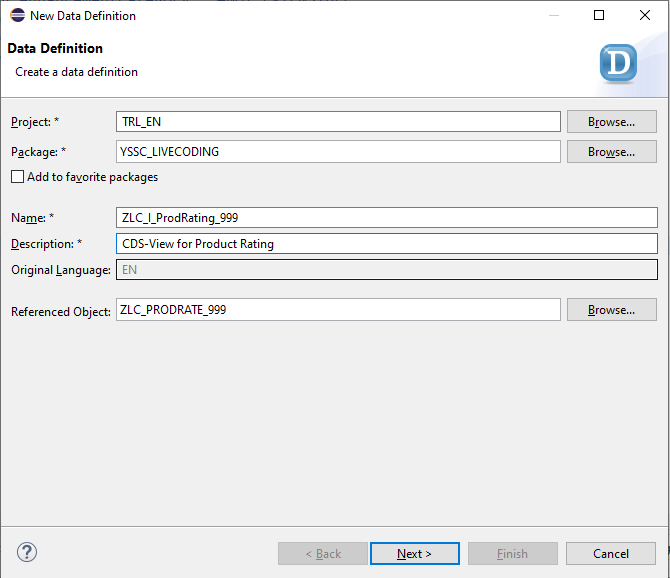

# Live-Coding Session

The aim of this Session, is to show how fast you can develop solutions with RAP and Steampunk, that would normally cost you days!

- [Live-Coding Session](#live-coding-session)
  - [Our Scenario](#our-scenario)
  - [What's RAP](#whats-rap)
  - [Getting the Products](#getting-the-products)
  - [Create Table](#create-table)
  - [Create Business Object](#create-business-object)
    - [Create CDS Root View](#create-cds-root-view)
    - [Create Behavior Definition](#create-behavior-definition)
    - [Create Behavior Implementation](#create-behavior-implementation)
    - [Create the Service Definition](#create-the-service-definition)
  - [Create a Custom Entity](#create-a-custom-entity)
  - [Consume OData-Service](#consume-odata-service)
  - [Build your first BO with RAP-Generator (optional)](#build-your-first-bo-with-rap-generator-optional)
  - [Describe your Fiori-App](#describe-your-fiori-app)

## Our Scenario

In a short time, we want to build a simple application, where a customer can rank a product. But to make it more exotic and show the strength of the cloud, our product list is not on the same system, but somewhere else and has to be consumed via OData.

## What's RAP

The ABAP RESTful Programming Model is the newest way and technology provided by SAP to create modern, RESTful applications with web based UIs - especially focused for sure on SAP UI5.
Google delivers a lot of information on this technology, by simply searching for "SAP RAP" and of course useful sources to get in touch with it, are as follows:

- [Official documentation](https://help.sap.com/viewer/923180ddb98240829d935862025004d6/Cloud/en-US/289477a81eec4d4e84c0302fb6835035.html?q=abap%20restful%20programming)
- [Blog Post by Sony Sukumar Kattoor as overview](https://blogs.sap.com/2019/05/23/sap-cloud-platform-abap-restful-programming-model-rap-for-beginners/)
- [Almost every post by André Fischer](https://people.sap.com/andre.fischer)
- [...and also Florian Wahl](https://people.sap.com/florian.wahl)

In very short terms explained:
In former Days, SAP logic was encapsulated by Business Objects, build out of Function Modules and Function Groups. But without any consistency in naming and functionality, so a lot of experience was needed, to find the right FM for the right task - if such one even existed!
Since S/4HANA, we have new **first class citizens** - and these are CDS Views! With Core Data Service Views, SAP invented a wrapper for a lot of Application Server Side logic hidden in Function Module with ABAP on how all the Data of a Business Object belong together - not very much "Code-Pushdown" as SAP preaches it since the first days of SAP HANA. All this changed with CDS, but these are Database **VIEWS** and as in every other database like Oracle or MS SQL, Views are read-only.
Based on these CDS Views, SAP redesigns the existing Business Objects to make them also easily consumeable via OData and with this, also for SAP UI5.


The foundation for a Business Object is now a CDS View (or a [CDS View Entity which is the successor for CDS Views with ABAP Platform 2020](https://blogs.sap.com/2020/09/02/a-new-generation-of-cds-views-cds-view-entities/)).
These Views are connected to a Behavior Definition, which defines the possible actions and a Behavior Implementation, which implements the logic. Out of this, we define a Service Definition, which lists the exposed entities and at least, we enter our protocol we want to use, i.e. OData V2 or OData V4.


## Getting the Products

This example should be a demo on how to bring cloud and on-Prem together, so for this, we need another system to connect to. The easiest way are the demo system provided by SAP via the [SAP API Business Hub](https://api.sap.com/).
Select here the SAP S/4HANA Cloud - perhaps an account registration before may be required for you.


On the next page we search for *product* and take a closer look, at the probably best fitting service according to description:


Here we find everything we need to get our product information. We can also test the API Calls directly and also create Code Snippets for consuming this Service in multiple, different programming languages.


## Create Table

At first step, we have to think about what we need, for a simple product rating and create a database table based on these identified requirements.

```abap
@EndUserText.label : 'Product-Rating'
@AbapCatalog.enhancementCategory : #NOT_EXTENSIBLE
@AbapCatalog.tableCategory : #TRANSPARENT
@AbapCatalog.deliveryClass : #A
@AbapCatalog.dataMaintenance : #RESTRICTED
define table zlc_prodrate_999 {
  key client      : abap.clnt not null;
  key rating_uuid : sysuuid_x16 not null;
  forename        : abap.char(40);
  surname         : abap.char(40);
  email           : abap.char(60);
  product         : abap.char(40);
  rating          : abap.int1;
}
```

## Create Business Object

### Create CDS Root View

After creating the table, just right click it and select **New Data Definition** to create a CDS Root View, based on our Database.


The next steps are "as always":




The result should look like this:

```abap
@AccessControl.authorizationCheck: #CHECK
@EndUserText.label: 'CDS-View for Product Rating'
define root view entity ZLC_I_ProdRating_999
  as select from zlc_prodrate_999
{
      //ZLC_PRODRATE_999
  key rating_uuid,
      forename,
      surname,
      email,
      product,
      rating
      //    _association_name // Make association public
}
```

### Create Behavior Definition

Now, we need to make our BO "intelligent". First Step for this, is creating a Behavior Definition - again with some wizard support via right click on the DDLS and select **New Behavior Definition**. For sure we'll use **Implementation Type: Managed** because we don't want loose time with implementing all the coding by ourself.


We define a very simple one and with our next step, we'll implement the Behavior Implementation, which is currently commented out.

```abap
managed; // implementation in class zbp_lc_i_prodrating_999 unique;

define behavior for ZLC_I_ProdRating_999 alias prod_rating
persistent table zlc_prodrate_999
lock master

{
  create;
  update;
  delete;
}
```

### Create Behavior Implementation

And again, we use the wizard to create out Behavior Implementation and use the before suggested name.


Simple activating the Behavior Implementation is at the moment everything, that needs to be done.

After the creation of the implementation, we need to comment in the class name in the Behavior Definition.

```abap
managed implementation in class zbp_lc_i_prodrating_999 unique;
```

### Create the Service Definition

First time after a while, we don't have an ultra easy wizard :-( - but it's ok.
Simple create a Service Definition by finding the right button in the context-menu.


The work, is very easy: with the command `expose`, we describe what entities should be exposed to our service - well, Rocket-Science!

```abap
@EndUserText.label: 'Service Definition for Product Rating'
define service ZLC_I_ProductRating_999 {
  expose ZLC_I_ProdRating_999;
}
```

## Create a Custom Entity

## Consume OData-Service

## Build your first BO with RAP-Generator (optional)

## Describe your Fiori-App
